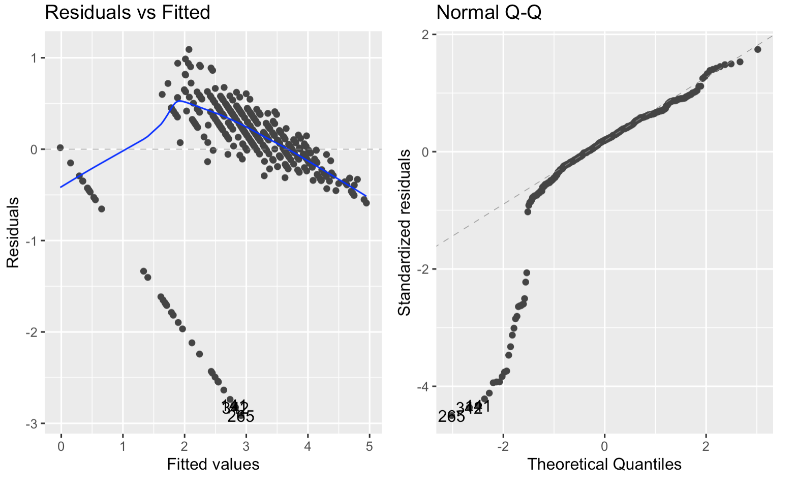
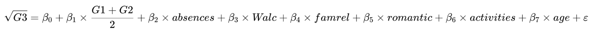

## Story

<small>In Portugal, nearly 40% of youth left school early in 2006 — more than double the EU average — highlighting serious challenges in student achievement.</small>

<small>Research question: What factors actually influence students’ performance in these key subjects?</small>

{fig-align="center" width="70%"}

---

## Data set

- **Dataset:** Mathematics dataset
- **Size:** 395 × 33
  - Numerical variables: 16
  - Categorical variables: 17

---

## Exploratory Data Analysis (EDA)

{width="60%" fig-align="center"}

<small>Most students score moderately in G1 and G2, while only a few show frequent absences or failures.</small>  
<small>Family relations are generally strong, suggesting a supportive environment.</small>  
<small>Overall, this is a stable, high-performing group with limited but meaningful variation to explore further.</small>

---

## Correlation

:::: columns
::: {.column width="60%"}
{width="100%"}  
{width="100%"}
:::

::: {.column width="40%"}
<small>• ANOVA: *p-value < 0.1*, |cor| > 0.15</small>  
<small>• Variables: higher, Mjob, romantic, G2, G1, Medu, Fedu, goout, failures, age</small>
:::
::::

---

## Model 1 — Original Linear Model

:::: columns
::: {.column width="45%"}
{width="100%"}
:::

::: {.column width="55%"}
**Model Summary**

<small>This model predicts students’ final grades using academic and demographic factors.</small>  
<small>Prior grades **G1** and **G2** are strong positive predictors, showing early performance drives final results.</small>  
<small>Other factors have little effect.</small>  
<small>The model explains about **83%** of grade variance, indicating strong predictive power mainly from prior performance.</small>
:::
::::

---

## Model 2 — √G3 Transformation

:::: columns
::: {.column width="60%"}
{width="100%"}
:::

::: {.column width="40%"}
<small>- Applies **square-root transformation** to improve normality & stabilize variance.</small>  
<small>- **Predictors:** same as Model 1.</small>  
<small>- **G2 (β = 0.236, p < 0.001)** remains strongest positive predictor.</small>  
<small>- **G1 (β = –0.039, p = 0.049)** remains significant but slightly reverses.</small>  
<small>- Others not significant.</small>  
<small>- **Adj R² ≈ 0.64:** better assumptions, slightly less variance explained.</small>
:::
::::

---

## Model 2 vs Model 1 Comparison

:::: columns
::: {.column width="48%"}
{width="100%"}
:::

::: {.column width="48%"}
{width="100%"}
:::
::::

{width="40%" fig-align="left"}

---

## Multicollinearity Test

:::: columns
::: {.column width="60%"}
{width="100%"}  
{width="100%"}
:::

::: {.column width="40%"}
**Interpretation**
<small>When two predictors such as G1 and G2 are highly correlated, the model struggles to separate their effects on G3, leading to unstable coefficients and inflated errors.</small>
:::
::::

---

## Model 3

:::: columns
::: {.column width="60%"}
{width="100%"}
:::

::: {.column width="40%"}
<small>Our model explains **62%** of grade variation.</small>  

<small>Better early grades, fewer absences, and strong family ties predict higher scores.</small> 

<small>Meanwhile, age and romantic relationships slightly lower performance.</small>
:::
::::
---

## Model 4 – Backward Stepwise (AIC)

:::: columns
::: {.column width="60%"}
{width="100%"}
:::

::: {.column width="40%"}
<small>- **Method:** backward stepwise selection based on **AIC**.</small>  
<small>- **Result:** no change in model structure or diagnostics.</small>  
<small>- **Coefficients & R² (≈ 0.62)** remain identical to Model 3.</small>  
<small>- Confirms the model is **stable and parsimonious**, with **no redundant predictors**.</small>
:::
::::

---

## Model Evaluation

{width="70%" fig-align="center"}

<small>Each observation represents a different student, so independence holds.</small>  
<small>The residuals–fitted plot shows curvature and unequal variance, indicating mild violations of linearity and homoscedasticity.</small>  
<small>The Q–Q plot deviates at both tails, suggesting non-normal residuals.</small>

---

## Model Selection – Cross Validation

:::: columns
::: {.column width="60%"}
{width="70%"}  
{width="70%"}
:::

::: {.column width="40%"}
<small>Based on cross-validation results, we chose **Model 3**.</small>  

<small>It performs almost as well as **Model 2**, but with a simpler and more interpretable design.</small>  

<small>By combining **G1** and **G2** into one average score, we reduce redundancy and multicollinearity.</small>  

<small>Overall, **Model 3** provides the best balance between **accuracy**, **interpretability**, and **robustness**.</small>
:::
::::

---

## Conclusion

{fig-align="center"}

- **Higher prior grades** and **family support** → better final outcomes  
- **Romantic relationships**, **activities**, **age** → slight negative effects  
- **Moderate socializing** → small positive effect  
- **Absences** → minimal impact  
- Overall: **Academic success depends on balance and good study habits**

## Limitation (1/2)

:::: columns
::: {.column width="55%"}
{width="100%"}
:::

::: {.column width="45%"}
**Limitations**

- **1️⃣ Variable Selection**  
  <small>The model mainly includes academic and personal factors (G1, G2, parental education, age), but ignores psychological, motivational, and social variables such as learning attitude or teacher–student interaction. This limits its explanatory scope.</small>  

- **2️⃣ Uneven Distribution of the Dependent Variable**  
  <small>The outcome variable **G3** is unevenly distributed with many zero scores. This deviation from normality may violate regression assumptions and reduce the accuracy of coefficient estimates.</small>
:::
::::
---

## Limitation (2/2)

:::: columns
::: {.column width="55%"}
{width="100%"}
:::

::: {.column width="45%"}
**Limitations (continued)**

- **3️⃣ Overly Strong Linearity Assumption**  
  <small>The model assumes linear relationships between predictors and the outcome, but students’ academic performance may involve nonlinear or interaction effects that a simple linear model cannot fully capture.</small>  

- **4️⃣ Violations of Homoscedasticity and Normality**  
  <small>Residual plots suggest heteroscedasticity and non-normal errors, indicating that the model’s fit is imperfect in some ranges. Transformations or nonlinear modeling could improve its robustness.</small>
:::
::::

---

## Logistic model

:::: columns
::: {.column width="60%"}
{width="100%"}
:::

::: {.column width="40%"}
<small> - **Strong model fit and predictive power**  </small>
<small>- **Prior grades** → strongest factor for passing   </small>
<small>- **Family support** helps performance   </small>
<small>- **Older students** less likely to pass   </small>
<small>- Other factors (absences, activities, romance) minor </small>
:::
::::
---

## Logistic model

---

## Storytelling
:::: columns
::: {.column width="60%"}
{width="100%"}
:::

::: {.column width="40%"}

:::
::::
---

## Storytelling

{width="100%"}

