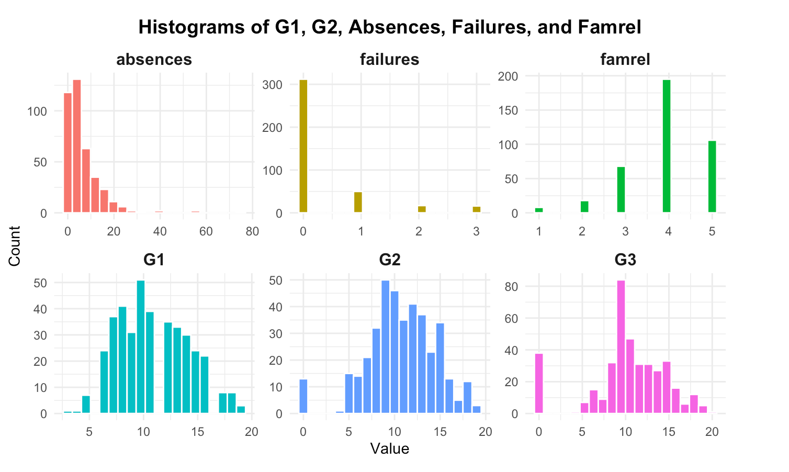
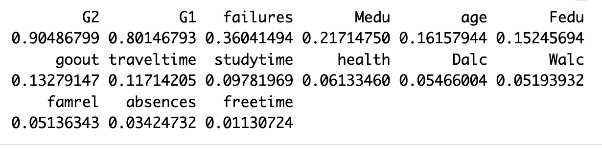
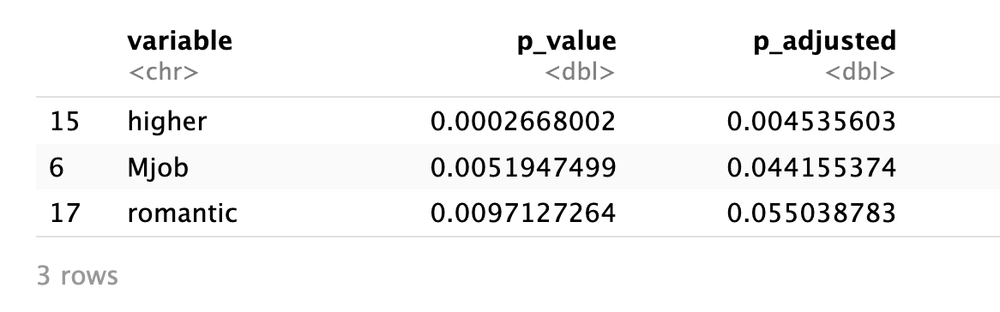
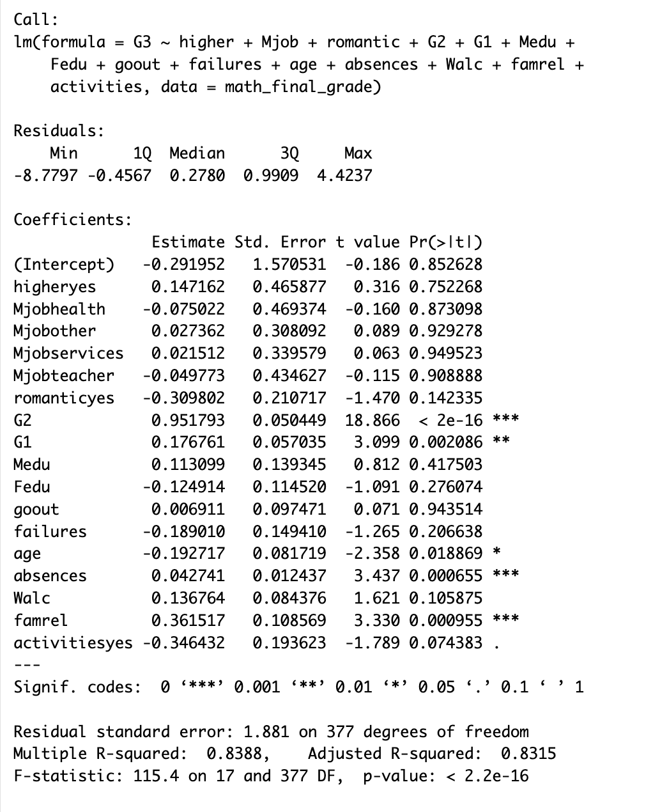
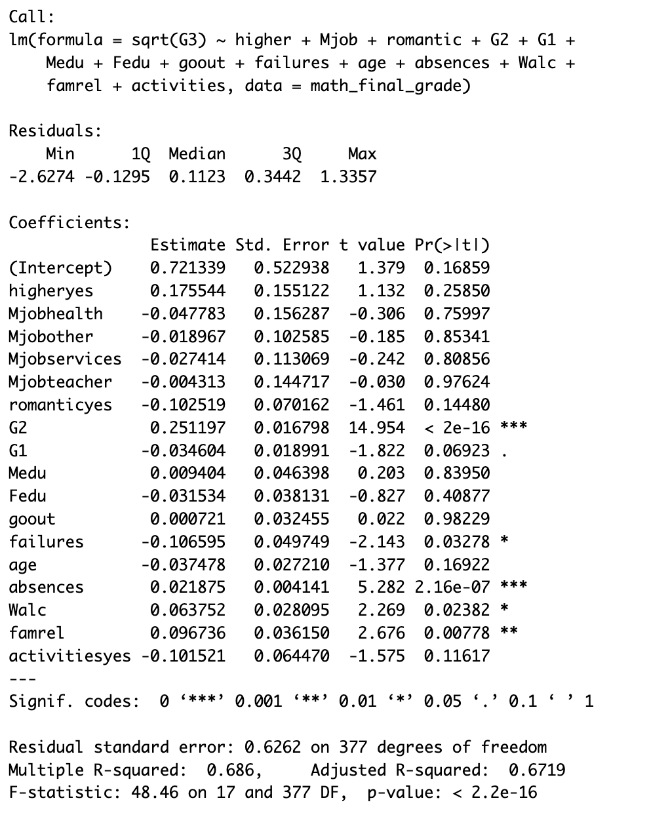
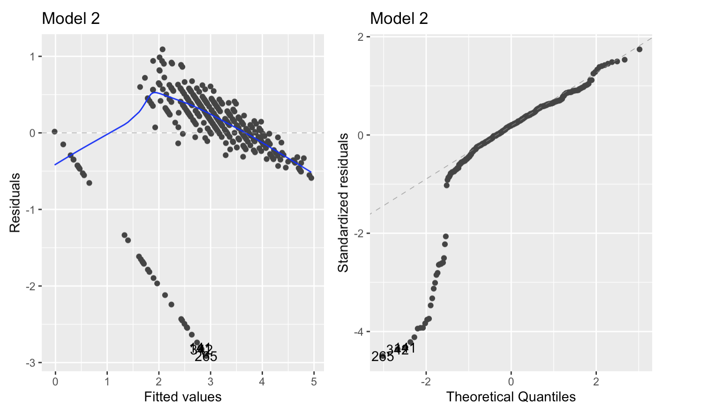
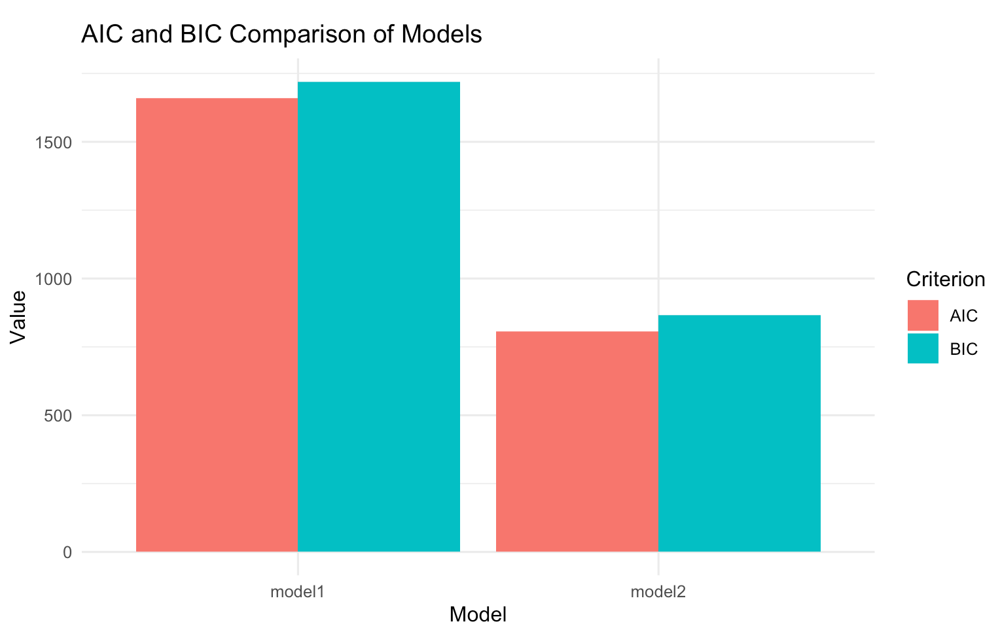
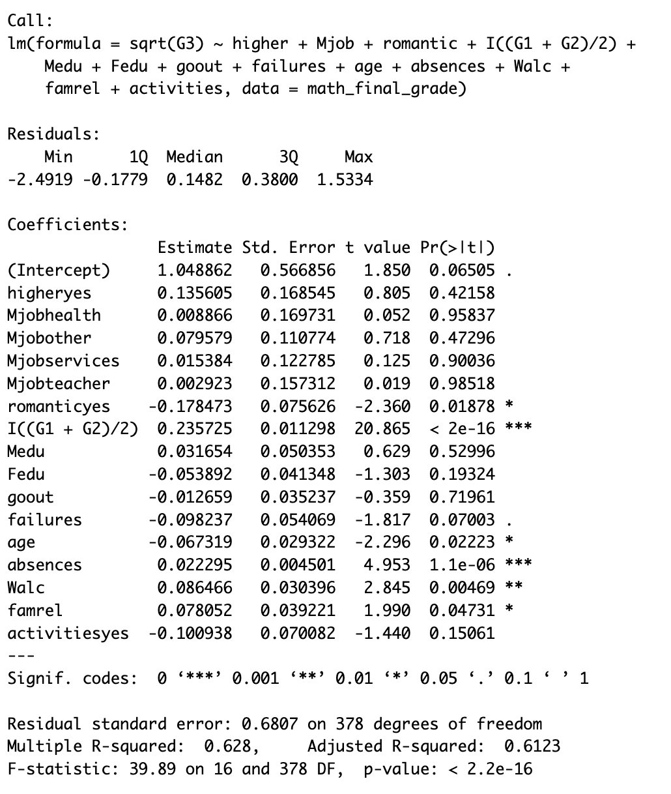
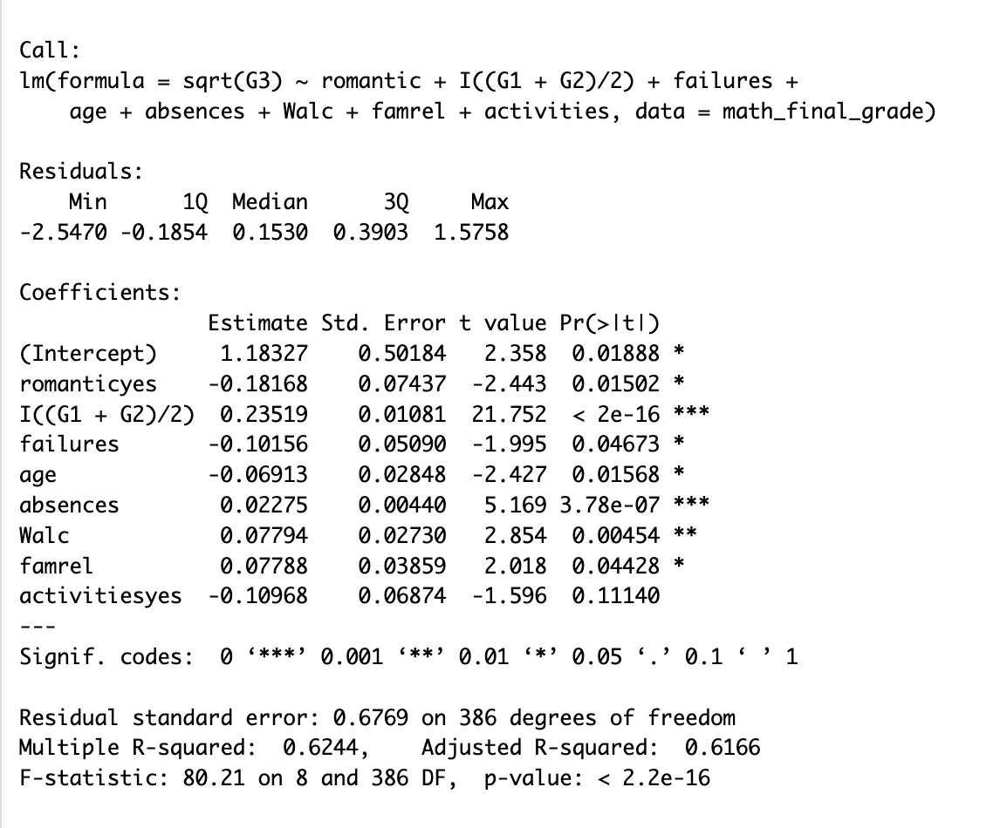
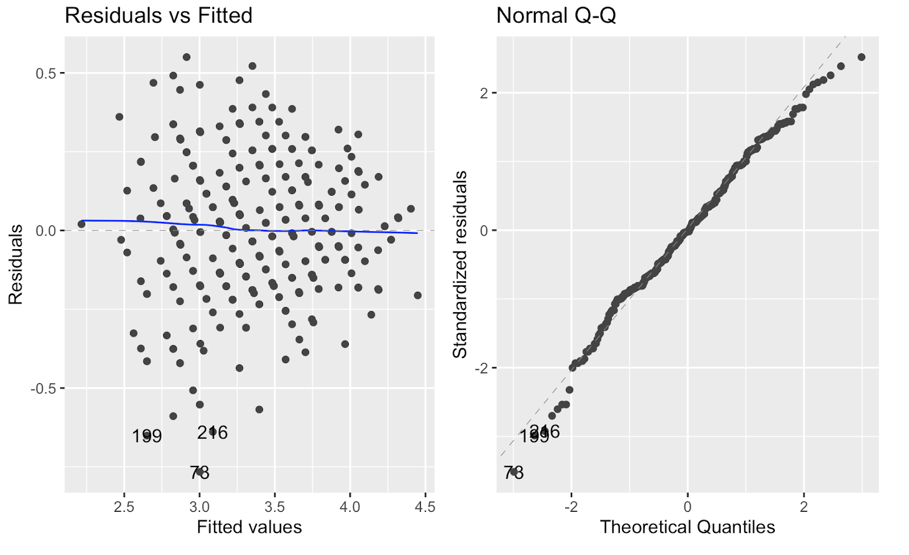

## Story

<small>In Portugal, nearly 40% of youth left school early in 2006 — more than double the EU average — highlighting serious challenges in student achievement.</small>

<small>Research question: What factors actually influence students’ performance in these key subjects?</small>

{fig-align="center" width="70%"}

------------------------------------------------------------------------

## Data set

-   We focus on Math dataset, rather than Portuguese grades, because it reflects students’ academic ability more objectively and is less affected by language or cultural factors.
-   **Missing values**: There is no missing values as specified in the dataset website.
-   **Dataset:** Mathematics dataset
-   **Size:** 395 observations × 33 variables
    -   Numerical variables: 16
    -   Categorical variables: 17

------------------------------------------------------------------------

## Exploratory Data Analysis (EDA)

{width="60%" fig-align="center"}

<small>Most students score moderately in G1 and G2, while only a few show frequent absences or failures.</small>\
<small>Family relations are generally strong, suggesting a supportive environment.</small>\
<small>Overall, this is a stable, high-performing group with limited but meaningful variation to explore further.</small>

------------------------------------------------------------------------

## Variables Selection

::::::: columns
:::: {.column width="60%"}
{width="100%"}\
{width="100%"}

::: {style="font-size:20px; line-height:1.2;"}
<small><em>Cited articles:</em></small>  <small>Centers for Disease Control and Prevention. (2024, July 19). Alcohol behaviors and academic grades.</small>  <small>Allensworth, E., & Easton, J. Q. (2007). What matters for staying on-track and graduating in Chicago Public High Schools. Consortium on Chicago School Research at the University of Chicago.</small>  <small>Keppens, G. (2023). School absenteeism and academic achievement: Does the timing of the absence matter? <em>Learning and Instruction, 86</em>, Article 101769.</small>
:::
::::

:::: {.column width="40%"}
<small>• ANOVA: *p-value \< 0.1*, \|cor\| \> 0.15</small>

<small>• We also selected some variables which might help predict G3 from some articles and news.</small>

<small>• Variables Selected: higher, Mjob, romantic, G2, G1, Medu, Fedu, goout, failures, age, absences , Walc, famrel, activities</small>

::: {style="font-size:16px; line-height:1.3; color:#FF6F61;"}
<b>Note:</b>  <i>higher</i>: wants to take higher education (binary: yes or no)  <i>Mjob</i>: mother’s job  <i>romantic</i>: with a romantic relationship (binary: yes or no)  <i>goout</i>: going out with friends (numeric)  <i>Medu</i>: mother’s education (0–4)  <i>G2</i>: second period grade (0–20)  <i>Walc</i>:weekend alcohol consumption  <i>famrel</i>:quality of family relationships 
:::
::::
:::::::

------------------------------------------------------------------------

## Model 1 — Original Model

::::: columns
::: {.column width="45%"}
{width="100%"}
:::

::: {.column width="55%"}
<small>This model predicts students’ final grades(G3) using academic and demographic factors.</small>

\
<small>Prior grades **G1** and **G2** are strong positive predictors, showing early performance drives final results. **Age** , **Absences** , **famrel** also showed significant predicting effect on G3.</small>

\
<small>Other factors have little effect.</small>

\
<small>The model explains about **83%** of grade variance, indicating strong predictive power mainly from prior performance.</small>
:::
:::::

------------------------------------------------------------------------

## Model 2 — Transformation

::::: columns
::: {.column width="50%"}
{width="100%"}
:::

::: {.column width="50%"}
<small>- Applies **square-root transformation** to improve normality & stabilize variance.</small>\

<small>- **Predictors:** same as Model 1.</small>\

<small>- **Adj R² ≈ 0.67:** slightly less variance explained.</small>

<small> [**Note:** After testing several transformations among different predictors and dependent variable, we concluded that the square-root transformation of G3 produced best improvement on the assumptions, enhancing residual normality and overall model fit.]{style="color:#FF6F61;"} </small>\
:::
:::::

------------------------------------------------------------------------

## Model 2(with transformation) vs Model 1 Comparison

::::: columns
::: {.column width="48%"}
{width="100%"}
:::

::: {.column width="48%"}
{width="100%"}
:::
:::::

::::: columns
::: {.column width="40%"}
{width="100%"}
:::

::: {.column width="48%"}
<small> Compared with Model 1, Model 2 shows more homogeneous residuals, improved normality, and substantially lower AIC/BIC values, indicating that the transformation improved assumption violations and produced a more parsimonious and reliable model. </small>
:::
:::::

------------------------------------------------------------------------

## Multicollinearity Test

::::: columns
::: {.column width="60%"}
{width="100%"}\
{width="100%"}
:::

::: {.column width="40%"}
**Interpretation** :

When two predictors such as G1 and G2 are highly correlated, the model struggles to separate their effects on G3, leading to unstable coefficients and inflated errors.
:::
:::::

------------------------------------------------------------------------

## Model 3

::::: columns
::: {.column width="50%"}
{width="100%"}
:::

::: {.column width="50%"}
-   **Action Taken**: to elminate *Multicollinearity*, we take the mean of G1 and G2.

-   Adjusted R Square: **62%**.

-   Better early grades, fewer absences, and strong family ties predict higher scores.

-   Meanwhile, age and romantic relationships had slightly lower performance.
:::
:::::

------------------------------------------------------------------------

## Backward Stepwise (AIC)

::::: columns
::: {.column width="60%"}
{width="100%"}
:::

::: {.column width="40%"}
<small> **Method:** backwards stepwise selection based on **AIC**.</small>

\
<small>**Result:** no change in model structure or diagnostics.</small>

\
<small>**Coefficients & R² (≈ 0.62)** remain identical to Model 3.</small>

\
<small>Confirms the model is **stable and parsimonious**, with **no redundant predictors**.</small>
:::
:::::

------------------------------------------------------------------------

## Model Selection – Cross Validation

::::: columns
::: {.column width="60%"}
{width="70%"}\
{width="70%"}
:::

::: {.column width="40%"}
-   <small>*Result*:Based on cross-validation results, we finally chose **Model 3**.</small>

-   <small>It performs almost as well as **Model 2**, but with a simpler and more interpretable design.</small>

-   <small>By combining **G1** and **G2** into one average score, we reduce redundancy and multicollinearity.</small>

-   <small>Overall, **Model 3** provides the best balance between **accuracy**, **interpretability**, and **robustness**.</small>

<small> [**Note:**\
Model1: original model\
Model2: with transformation\
Model3: removal of *Multicollinearity*\
Model4: the model where I ran the backwards stepwise selection on the full data model.\
]{style="color:#FF6F61;"} </small>\
:::
:::::

------------------------------------------------------------------------

## Model Evaluation

{width="70%" fig-align="center"}

<small>*Independence*:Each observation represents a different student, so independence holds.</small>

<small>*Homoscedasticity and Linearity*: The residuals–fitted plot shows curvature and unequal variance, indicating mild violations of linearity and homoscedasticity.</small>

<small>*Normality*:The Q–Q plot deviates at lower tail, suggesting non-normal residuals.</small>

------------------------------------------------------------------------

## Conclusion

{fig-align="center"}

-   <small>**Overall Performance**:the model explains about 62% of the variance in final grades.The F-test is highly significant (p \< 2.2e−16), indicating the overall model is statistically reliable.</small>\
-   <small>**(G1 + G2)/2**, The strongest positive predictor,suggesting that higher previous grades strongly improve final performance.</small>\
-   <small>**romantic, age,failures,absences,Walc,famrel,activitiesyes** → small effect</small>\
-   <small>**absences** → minimal impact</small>\
-   <small>Prior academic performance is the main driver of final grades, while personal and family factors have minor influences.</small>

------------------------------------------------------------------------

## Limitations (1/2): Data & Features

::::: columns
::: {.column width="50%"}
{width="90%"}
:::

::: {.column width="50%"}
-   **1.Uneven Distribution of the Dependent Variable**\
    <small>Many zeros in **G3** distort assumptions.Future work should include more behavioural variables and adjust for zero-heavy data.</small>

-   **2. Variable Selection**\
    <small>It relies mostly on grades and basic info, missing psychological and social factors like attitude or teacher interaction.</small>
:::
:::::

------------------------------------------------------------------------

## Limitations (2/2): Model Assumptions

::::: columns
::: {.column width="50%"}
{width="90%"}
:::

::: {.column width="50%"}
-   **3. Overly Strong Linearity**\
    <small>This model assumes straight-line relationships between factors and grades, but real academic performance is often more complex — nonlinear or with interactions.</small>

-   **4.Violations of Homoscedasticity and Normality**\
    <small>Residual plots also show uneven variance and non-normal errors, meaning the model fits well overall but not perfectly. </small>
:::
:::::

------------------------------------------------------------------------

## Why Logistic? (Too many zeros in G3)

<small>**So far, we can explain the gap between the grades very well.But there are a lot of 0 scores in G3; the overall linear regression violates the normality and homoscedasticity assumptions. Therefore, we first binarize the target variable (G3=0 vs. G3\>0) and use logistic regression to predict whether the student will get a zero score.**</small>

-   **Create a Binary Outcome Variable**\
    <small>Converted the continuous final grade (G3) into a binary variable (pass = 1 if G3 \> =10, else 0) to classify students as pass or fail.</small>

-   **Build a Logistic Regression Model**\
    <small>Fitted a logistic model predicting pass using prior grades, absences, weekend alcohol use, family relationship, romantic status, activities, and age.</small>

------------------------------------------------------------------------

## Key Findings from Logistic Model

::::: columns
::: {.column width="50%"}
{width="80%"}

{width="90%"}
:::

::: {.column width="50%" style="font-size:30px;"}
-   From the summary,we know that students with strong prior grades and supportive family environments have the highest probability of passing.

-   After excluding G3 = 0 observations, we refitted the model on passing students (G3 \> 10) to reveal which factors distinguish average performers from top achievers among those no longer at risk of failing.

-   The second plot showed that the refitted linear model perfectly meet the assumptions.
:::
:::::

------------------------------------------------------------------------

## Story Telling

::::: columns
::: {.column width="45%"}
{width="85%"}
:::

::: {.column width="55%"}
From our model result, we learnt that Earlier grades (average of G1 and G2) matter most, while family support also helps. Normal leisure time doesn’t hurt final performance, but romance and older age (often repeaters) slightly lower it. In short, steady effort and emotional balance matter more than study hours or attendance.
:::
:::::

------------------------------------------------------------------------

## Back To Real Life

::::: columns
::: {.column width="45%"}
{width="100%"}
:::

::: {.column width="55%"}
Back to real life, we’ll identify issues early—such as declining grades or weak family support—take quick action. It’s a success when students improve, attend classes more regularly, and feel better supported—all achieved with clear guidelines and minimal extra work for teachers.
:::
:::::
