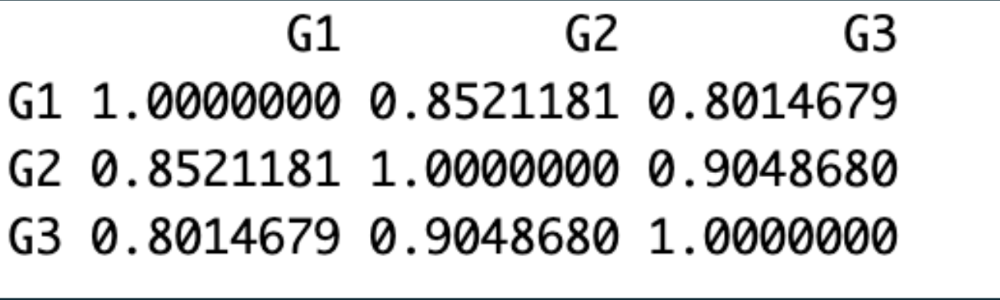
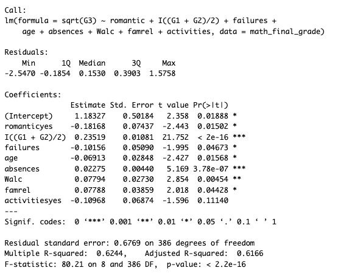
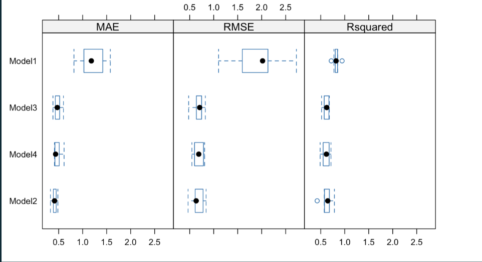
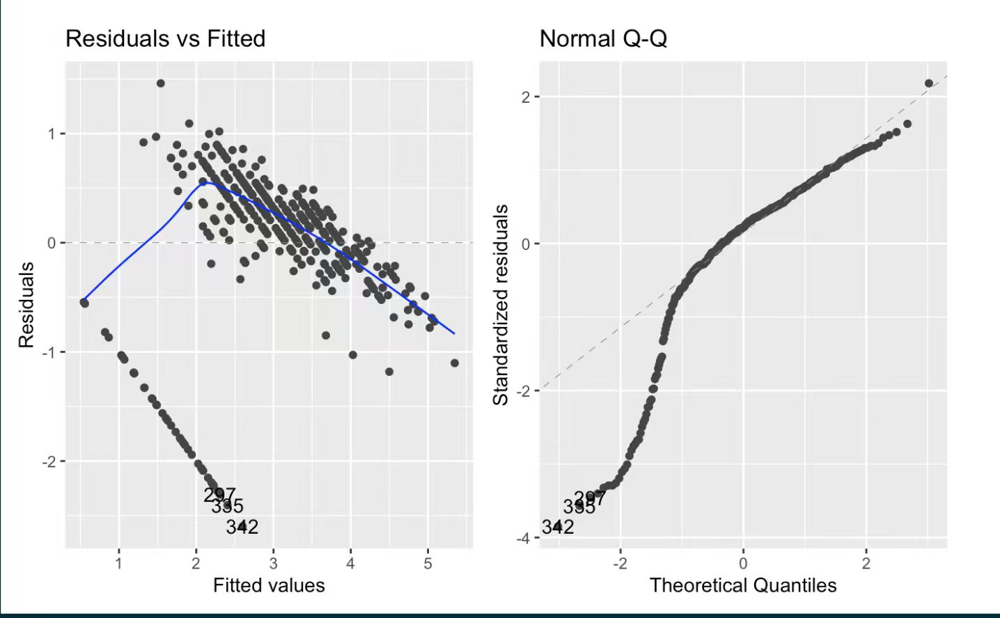
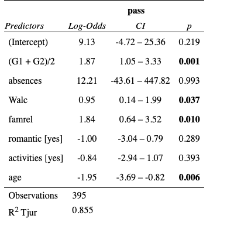

```{r setup, include=FALSE}
knitr::opts_chunk$set(
echo = FALSE, message = FALSE, warning = FALSE,
fig.align = "center", fig.width = 6.5, fig.height = 4.2
)
```

# Abstract

Using the UCI Student Performance dataset, this report analyzes the main
elements that influence the student’s final mathematics grade
(G3).(Cortez,2008) Exploratory analysis and model comparisons lead to
the final linear model,with prior academic grades being the foremost predictor.
Companion logistic model results confirmed  that initial academic
performance and supportive family contexts are the chief determinant of 
the final outcome.

# Introduction

In 2006, around 40% of young people in Portugal left school early—twice
the average of the European Union—showing alarming trends in student
achievement and engagement.(Cortez & Silva, 2008) This study baseline
attempts to understand what really impacts the academic achievement of
students in key subjects.Through the study of the learning
environment, family and personal factors, the study attempts to
understand what impacts students' academic performance to the highest
degree. This should give actionable intelligence to educators and
policymakers aimed at performance improvement and dropout rate
reduction.In the report, all the data are sourced from Portuguese high
schools.

# Dataset

The student performance dataset was collected from students in two
Portuguese secondary schools. Mathematics dataset was used rather 
than the Portuguese language dataset, which is less influenced by 
culture and language.  This dataset contains 395 students and 
33 variables, with no missing variables mentioned in official declaration.

Key variables are three stage grades G1, G2, and G3 (0–20),  which 
are interconnected. We noticed that there exists a large proportion of
students (about 40 students) who got 0 in the final grade (G3); absence
is a right-skewed factor that relates negatively to G3. Most students
got 0 failures as shown in the histogram of failures. Family-related
variables such as famrel (quality of family relationships) and parental
education show overall high values, which indicates their families are
generally well-educated. Social and behavioral factors such as higher
(whether the student intends to pursue higher education), Mjob (mother’s
job), romantic (whether the student is in a romantic relationship),
goout (frequency of going out with friends, 1–5), Medu (mother’s
education level, 0–4), Walc (weekend alcohol consumption) These 
characteristics, alongside the academic variables such as G2 
(second period grade), provide useful context for understanding student
performance patterns. These variables provide a solid demographic and 
social foundation to study factors affecting academic performance in mathematics.

# Analysis

## Model1

We built our origin model using all selected variables via backwards,
forwards stepwise selections, correlation test and related literal,
which outputs the following formula:

$$G3 \sim higher + Mjob + romantic + G2 + G1 + Medu + Fedu + $$
$$goout + failures + age + absences + Walc + famrel + activities$$

The coefficient showed that G1 and G2 are the most significant
predictors of final grade(G3), indicating early academic performance has
a strong effect on G3. However, when checking the linear regression
assumptions via residual plots and Q-Q plot, both plots revealed
non-normality and heteroscedasticity.

## Model2

To address assumption failures, we performed various transformations on
different combinations of variables, including square-root and
logarithmic transformation. We then compared different transformation
models via cross validation and adjusted R square, and found that
square-root transformation to the dependent variable (G3) produced the
best performance of the model, improving residual normality and variance
stability, with a slight decrease in adjusted R square.

## Model3

Correlation tests between variables revealed a strong linear
relationship between G1 and G2 (r=0.85). This indicates that
multicollinearity issue exists, which could lead to unstable
coefficients, and reduced model reliability. We then used the average
value of G1 and G2  to represent the overall early academic performance
of students’ to eliminate multicollinearity. This transformation
successfully improved the coefficient estimates and the adjusted
R2 of about 0.62. 

Then to achieve the balance between model simplicity and accuracy, we
conducted another backwards and forwards stepwise selections on Model3,
and got a similar summary from both stepwise selections. After that, we
compared all models using 10-fold cross-validation. According to
adjusted R square, RMSE and MAE, we finally selected Model3, achieving
slightly lower in-sample performance than the full model but
demonstrated stronger out-of-sample performance.From the summary, we
found that our final model explained about 0.61 variation on G3. 
Overall, Model 3 provided the optimal balance between accuracy,
interpretability, and robustness.

$$\sqrt{G3} = 1.18327 - 0.18168\,romantic_{yes} + 0.23519\,\frac{(G1+G2)}{2}- $$
$$0.10156\,failures - 0.06913\,age+ 0.02275\,absences $$
$$+ 0.07794\,Walc+ 0.07788\,famrel - 0.10968\,activities_{yes} + \varepsilon$$

## Logistic model

We noticed that our linear model failed to meet the linear regression
assumptions, which motivated us to complement our linear model with a
logistic model. We also considered the extreme lower-tail observations
of G3. we chose the cutpoint 10 to split the continuous final grade G3 
into a binary variable；this mid-scale threshold aligns with the natural grading
scheme and produces approximately balanced class distributions.
Cross-validation also supported 10 as the best split in terms of overall
RMSE/MAE. We then convert the observations whose G3 \<= 10 to 0 and 
observations whose G3 \> 10 to 1, and fit a logistic regression, with
predictors selected from our final linear model. From the logistic model
summary, we found that prior grade and strongly significant, while 
weekend alcohol consumption and famrel are also significant at the 5% level;
Other behavioral or social variables show less significant impact. The remaining
predictors are not significant according to p-value. This highlights that 
prior performance and family relationship quality are strongly associated 
with passing, whereas greater age is associated with a substantially lower 
probability of passing.These predictors provide complementary evidence to 
support early inferences system development.

# Result

Our final linear regression model with transformation on dependent(G3),
and average (G1+G2)/2 achieves p-value smaller than 0.05 and adjusted R
square 0.62, which explains about 62% of the variation in students’
G3(G3). At 5% significant level, (G1+G2)/2, absences , Walc , famrel ,
romanticyes, age ,failures shows significance for predicting G3,
Interpreting the coefficient of the final
linear regression model, square root of final grade(G3) is expected to
increase by 0.24, when increasing the average of G1 and G2 by 1 level.
The corresponding p-value of this combination of predictors is much
smaller than 0.05, which indicates the earlier grade did perform well
when predicting G3. Holding other factors constant, each additional year
of age slightly reduces square root of G3 by -0.06, and being in a
romantic relationship lowers it by 0.17. One level increase in famrel
increases the square root of G3 by 0.08, while parental education does
not significantly affect the square root of G3.

When evaluating the assumptions of our final linear regression model, we
can’t find any support document or official declaration to justify the
observations in mathematics student performance dataset are all
independent. Thus, independence assumption does not hold without other
justification. From normal Q-Q plot and residual plot, we observed major
curvature and unequal variance, implying large deviations from linearity, 
normality and homoscedasticity. We believe this is affected by a large 
number of observations whose G3=0. 

To preserve data integrity as much as possible with consideration of
assumption failures, a logistic model was fitted. Observed from summary, the
average of early grades, absences, Walc, famrel, age remain significant
in the logistic model. The average earlier grade has 1.87
log-odds,(with 95% CI 10.5-3.33). This implies a one-level increase
raises the log-odds of G3 \> 10 by 1.87(with Odd Ratio increased by
6.49). famrel shows 1.84 log-odds, which indicates that an on-level
increase raises the log-odds of G3\>10 by 1.84; Walc has 0.95 log-odds.
These patterns confirm that earlier grades and good family relationships
indeed drive success, while older age slightly reduces the chance of
passing.

# Conclusion and discussion

Our study shows that students who perform well in the earlier academic
performance are more likely to achieve high G3. Besides this reliable
factor, strong family support and higher parental education add extra
marks on G3. While older age and being in a romantic relationship have
slightly small negative effects on G3. Similar predictors between final
linear regression model and logistic model indicate earlier good
academic performance and family supportive family are key factors to
final academic success. 

## Limitations

1.  Both models used only academic and demographic information. This has
    omitted other motivational factors, such as teacher interaction,
    students’ confidence, and school activities, which possibly
    contribute to predicting students’ G3.

2.  G3 is unevenly distributed with many zeros, which breaks
    homoscedasticity, although we have performed a logistic model to
    complement our result. Another suitable model is needed.

3.  After transformations and diagnostics, several assumptions (linearity,
homoscedasticity, normality) are still violated.The independence assumption
may be violated, as a similar study or living environment is allowed when 
collecting the data,which has violated the independence assumption.


4.  Because the final linear model uses ((G1+G2)/2) to predict final
    grade, practical deployment often needs to wait for the
    second-period grade (G2), which may not be practical

In practice, the model can be used by teachers or the education
department to identify the students who might get failed in the final
mathematics assessment. By inputting students’ early grades(G1 and G2),
family-relationship level and age, our logistic model can estimate the
probability of achieving G3 \> 10 academic performance. The academic
help and targeted tutoring can then be provided to corresponding
students before it is too late.

## Future research:

A refined linear model can be built using only observations with
(G3\>10) to investigate variation among students who may get more than
10 in G3. Furthermore, we can collect more variables from different
angles, including emotion and motivation, to get a well-rounded model.
Apart from these, we need to consider non-linear and interaction
factors, which might be more suitable for predicting G3. The random
forest can also be used to predict, as this does not require too many
assumption restrictions. To avoid waiting for (G2), an early-stage model
only using G1 could be deployed first to get an earlier warning for the
students who might get failed in the G3.

\newpage

# Appendix

## Figures

\

Figure 1. Correlation among G1,G2 and G3

```{r figs_1, fig.align='center', fig.show='hold', out.width='50%'}

```

Figure 2. Model3 Summary

```{r figs_2, fig.align='center', fig.show='hold', out.width='70%'}

```

Figure 3. Cross Validation

```{r figs_3, fig.align='center', fig.show='hold', out.width='70%'}

```

Figure 4. Residual Plot and Normal QQ-plot

```{r figs_4, fig.align='center', fig.show='hold', out.width='70%'}

```

Figure 5. Summary of Logistic Regression Model

```{r figs_5, fig.align='center', fig.show='hold', out.width='70%'}

```

## References

\

\begingroup
\setlength{\parindent}{0pt}
\setlength{\parskip}{0.5em}
\sloppy
\emergencystretch=2em

\Urlmuskip=0mu plus 2mu \def\UrlBreaks{\do\/\do-\do\_\do\.\do\?\do\&}

\hangindent=0.5in \hangafter=1 Allensworth, E., & Easton, J. Q. (2007).
\textit{What matters for staying on-track and graduating in Chicago Public High Schools}.
Consortium on Chicago School Research at the University of Chicago.

\par

\hangindent=0.5in \hangafter=1 Keppens, G. (2023). School absenteeism
and academic achievement: Does the timing of the absence matter?
\textit{Learning and Instruction, 86}, Article 101769.

\par

\hangindent=0.5in \hangafter=1 Cortez, P., & Silva, A. (2008).
\textit{Using data mining to predict secondary school student
performance}. University of Minho.
\url{https://repositorium.uminho.pt/server/api/core/bitstreams/991a0e2b-249d-466d-afef-937d975ff7fc/content}

\par

\hangindent=0.5in \hangafter=1 Zhao, L., & Zhao, W. (2022). Impacts of
family environment on adolescents’ academic achievement: The role of
peer interaction quality and educational expectation gap.
\textit{Frontiers in Psychology, 13}.

\par

\hangindent=0.5in \hangafter=1 Centers for Disease Control and
Prevention. (2024, July 19).
\textit{Alcohol behaviors and academic grades}.

\par

\hangindent=0.5in \hangafter=1 Pedersen, T. L., Wickham, H., & van den
Brand, N. (n.d.).
\textit{ggplot2: Elegant Graphics for Data Analysis (3e)}.
\url{https://ggplot2-book.org/}

\par

\hangindent=0.5in \hangafter=1 Tidyverse. (n.d.).
\url{https://tidyverse.org/}

\par

\hangindent=0.5in \hangafter=1 STHDA. (n.d.).
\textit{ggfortify: Extension to ggplot2 to handle some popular packages}.
\url{https://www.sthda.com/english/wiki/ggfortify-extension-to-ggplot2-to-handle-some-popular-packages-r-software-and-data-visualization}

\par

\hangindent=0.5in \hangafter=1 Kuhn, M. (n.d.).
\textit{A Short Introduction to the caret Package}.
\url{https://cran.r-project.org/web/packages/caret/vignettes/caret.html}

\par

\hangindent=0.5in \hangafter=1 Wickham, H., Fran\c{c}ois, R., Henry, L.,
& M"uller, K. (n.d.). \textit{A grammar of data manipulation}.
\url{https://dplyr.tidyverse.org/}

\par

\hangindent=0.5in \hangafter=1 Cortez, P. (2008).
\textit{Student Performance}.
\url{https://archive.ics.uci.edu/dataset/320/student+performance}

\par

\hangindent=0.5in \hangafter=1 XeLaTEX. (n.d.).
\textit{Overleaf, Online LaTeX Editor}.
\url{https://www.overleaf.com/learn/latex/XeLaTeX}

\par

\endgroup
